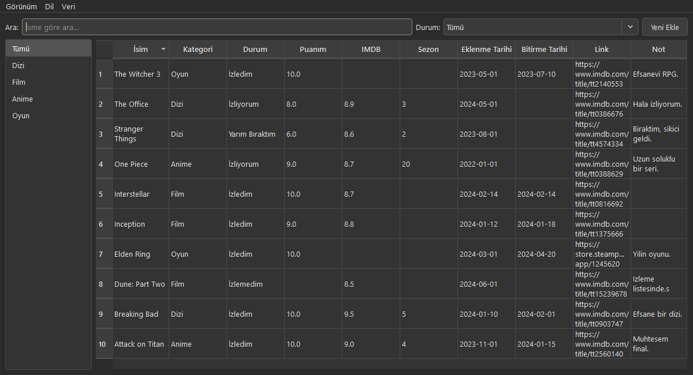

# WhatIWatched

Dizi, film, anime ve oyunlarını tek yerden takip etmek için kişisel bir masaüstü uygulaması. Ne izlediğini, ne izlemediğini, ne kadar beğendiğini ve notlarını kaydet.



## Özellikler

- **Kategoriler:** Dizi, Film, Anime, Oyun
- Her kayıt için: isim, kategori, durum (izledim / izlemedim / izliyorum / yarım bıraktım), kendi puanın, IMDB puanı, link, sezon (Dizi/Anime), eklenme ve bitirme tarihi, serbest not
- Kategoriye ve duruma göre filtreleme, isme göre anlık arama
- Sütun başlığına tıklayarak sıralama
- **Açık ve koyu tema**, anında geçiş
- **Türkçe ve İngilizce** dil desteği
- **JSON olarak dışa/içe aktarma** — verilerini yedekle veya başka bir bilgisayara taşı
- Tüm veriler yerel bir SQLite dosyasında (`whatiwatched.db`) tutulur — internet bağlantısı, hesap veya bulut gerekmez

## İndir ve Çalıştır (Windows)

Kurulum gerektirmez. [Releases](../../releases) sayfasından en güncel `WhatIWatched.exe` dosyasını indirip çalıştırman yeterli. Uygulama, `.exe` dosyasının bulunduğu klasörde kendi veritabanını otomatik olarak oluşturur.

## Kaynak koddan çalıştırma

```bash
git clone https://github.com/Chaxindow/whatiwatched.git
cd whatiwatched
python -m venv venv
venv\Scripts\activate
pip install -r requirements.txt
python main.py
```

## Kendi .exe'ni derlemek istersen

```bash
pip install pyinstaller
pyinstaller --onefile --windowed --name WhatIWatched --icon=assets/icon.ico --add-data "assets;assets" main.py
```

Derlenen dosya `dist/WhatIWatched.exe` altında oluşur.

## Kullanılan teknolojiler

- [Python](https://www.python.org/) + [PySide6](https://doc.qt.io/qtforpython/) (arayüz)
- SQLite (veritabanı)
- [PyInstaller](https://pyinstaller.org/) (.exe paketleme)
